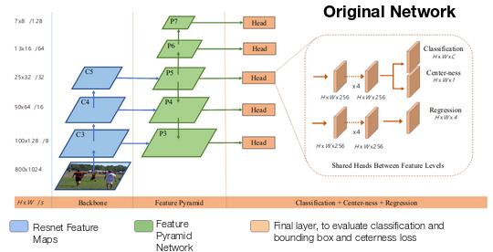
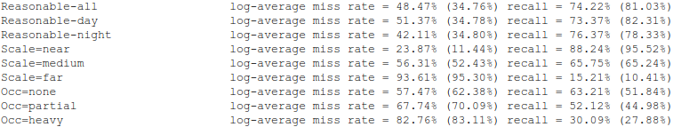

# Multispectral FCOS: Fully Convolutional One-Stage Object Detection     


## Abstract
This is a tensorflow implementation is inspired by [FCOS: Fully Convolutional One-Stage Object Detection](https://arxiv.org/abs/1904.01355), the code is derived from [DetectionTeamUCAS](https://github.com/DetectionTeamUCAS/FCOS_Tensorflow).     

## Original Network
         
## Current Implementation
         

## My Development Environment
1、python3.5             
2、cuda8.0                     
3、[opencv(cv2)](https://pypi.org/project/opencv-python/)    
4、[tfplot](https://github.com/wookayin/tensorflow-plot)             
5、tensorflow >= 1.12                   
6、MATLAB / GNU Octave                   

## Download Model
### Pretrain weights
1、Please download [resnet50_v1](http://download.tensorflow.org/models/resnet_v1_50_2016_08_28.tar.gz), [resnet101_v1](http://download.tensorflow.org/models/resnet_v1_101_2016_08_28.tar.gz) pre-trained models on Imagenet, put it to data/pretrained_weights.       

### Trained weights

1、Please download [kaist_model]() , and put it in output/trained_weights </br>
2、Download the tfrecord [dataset]() , and put it in data/tfrecord </br>
3、Download the results [images and text files]() , and put it in output/test_results </br>


## Compile

```  
cd $PATH_ROOT/libs/box_utils/cython_utils
python setup.py build_ext --inplace

cd $PATH_ROOT/libs/box_utils/nms
python setup.py build_ext --inplace
```

## Train
1、Train
```  
Make sure pretrained models and tfrecord are in repsective directories

cd $PATH_ROOT/tools
python multi_gpu_train_v2.py --GPU 1

```


## Test
1、Testing on the KAIST - Test Set
```  
Make sure trained models is in the correct directory

cd $PATH_ROOT/tools

python test.py --rgb_data_dir PATH_TO/Reasonable_test_depth/visible --ir_data_dir PATH_TO/Reasonable_test_depth/lwir --save_dir PATH_TO/output/test_results --GPU 0

```


## Eval
1、Evaluating the miss-rate of the obtained results
2、Copy results from output/test_results/txt -> eval/det
3、Arrange Ground Truth annotations in the following format

```  
Ground_truth_directory

  --test-all
    ----annotations (these are orignal annotations)
    ----annotations_KAIST_test_set (these are imporved annotations)

  --test-day
    ----annotations (these are orignal annotations)
    ----annotations_KAIST_test_set (these are imporved annotations)

  --test-night
    ----annotations (these are orignal annotations)
    ----annotations_KAIST_test_set (these are imporved annotations)
```  
4、Evaluate Metrics

```  
run demo_test.m from MATLAB/GNU OCTAVE
``` 

## Results Obtained
         

## Reference
1、https://github.com/endernewton/tf-faster-rcnn   
2、https://github.com/zengarden/light_head_rcnn   
3、https://github.com/tensorflow/models/tree/master/research/object_detection        
4、https://github.com/CharlesShang/FastMaskRCNN       
5、https://github.com/matterport/Mask_RCNN      
6、https://github.com/msracver/Deformable-ConvNets      
7、https://github.com/tianzhi0549/FCOS       
8、https://github.com/Li-Chengyang/MSDS-RCNN       
